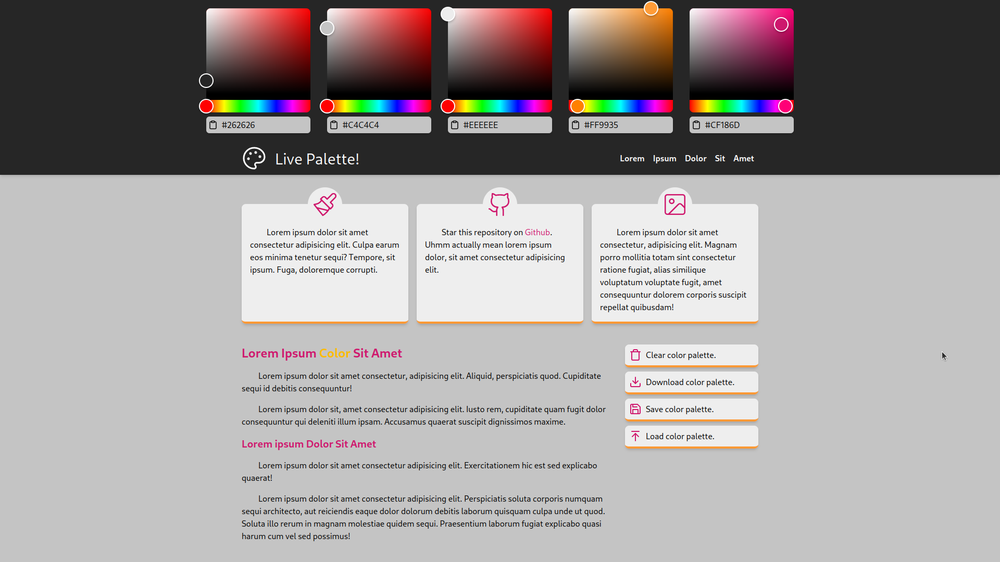
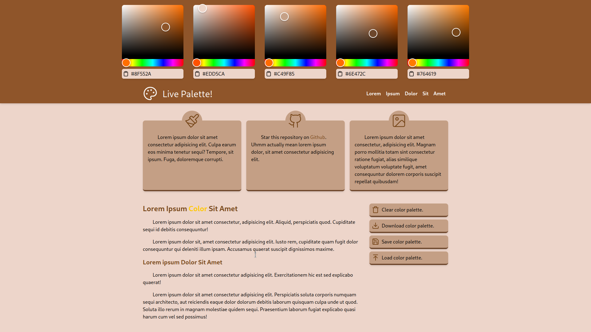

# Live Palette!

When a designer choosed/created a color palette and then applied it to their web design, the might not like that palette.

The palette was good, but did not fit with the site they design.

So, I have create this web site to see your color palette on a template website as you changed your colors. Watch the changes live!

Also you can download the palette as a card image.

Here is some examples:

